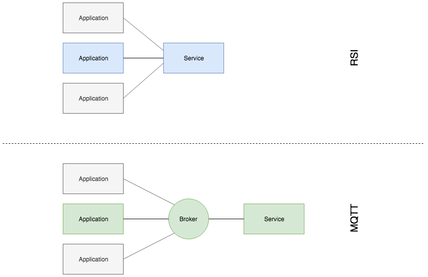

# WebSockets vs MQTT

This tool is made to evaluate MQTT vs WebSocket

## Why this test

All the big cloud provider offer MQTT solutions to connect [Internet of Things](https://en.wikipedia.org/wiki/Internet_of_things) devices and services. Obviously, MQTT is the state-of-the-art way of connecting millions of devices to the internet and publishing state information.

**Is it really the right way of connecting a vehicle to the cloud, a scenario where each vehicle publishes and subscribes to an OEM backend individually? Does MQTT really play to its strength in the scenario?**

### MQTT

[MQTT](https://en.wikipedia.org/wiki/MQTT) is very stroing when it comes to:

* low(est) overhead
* low power consumption (CPU)
* (multi peer) publish subscribe
* Quality of service adaptation built-in

applications. But it does not (yet) support:

* custom headers
* protocol level compression
* transactional communication

So these things need to be built on application level and because all of it has to go into the payload, an important question to answer is:

**What does the application level protocol look like? What are the blobs MQTT is sending around?**

### RSI/WebSockets

downsides:
- not yet standard
- not of the shelf solutions
- no Quality of service adaptation built-in
- not optimized for low power consumption

but:

* low(er) overhead (on WebSockets)
* custom headers
* protocol level compression
* transactional communication
* defines application level protocol, even tooling is available
* (peer2peer) publish subscribe
* brokering easy to replicate (allowing multi-peer pub/sub)

## Architecture

An application sends messages to an echo server / broker and is responded with the same message. The messages are timestamped to allow traveltime calculations. The nunmber of messages and the total travel time is measured.

 For evaluation, the messages travel time is devided into half to calculate the "server 2 client latency" for WebSockets. As per design the MQTT services and applications will always have a broker between them, therefore traveltime must not be devided into half.

### Compression

While WebSockets support compression on protofol level (per-message-deflate), the client must compress the payload before sending it (application level) in the MQTT case.

## How to run it

First install dependencies

```shell
$ npm install
```

then run the server

```shell
$ npm run start:server
```

Finally open the UI in your browser on port 3000

e.g. http://127.0.0.1:3000

## Tests

JSON payload serialized

```
throughput MByte/s with compression
  package size 256 Byte / 1kB / 10kB / 128kB
throughput MByte/s without compression
  package size 256 Byte / 1kB / 10kB / 128kB
latency ms with compression
  package size 256 Byte / 1kB / 10kB / 128kB
latency ms without compression
  package size 256 Byte / 1kB / 10kB / 128kB
bandwidth consumed MByte/1000msg with compression (incl. protocol layer overhead)
  package size 256 Byte / 1kB / 10kB / 128kB
bandwidth consumed MByte/1000msg compression (incl. protocol layer overhead)
  package size 256 Byte / 1kB / 10kB / 128kB
```

protobuf as a competitor?
* Why not?